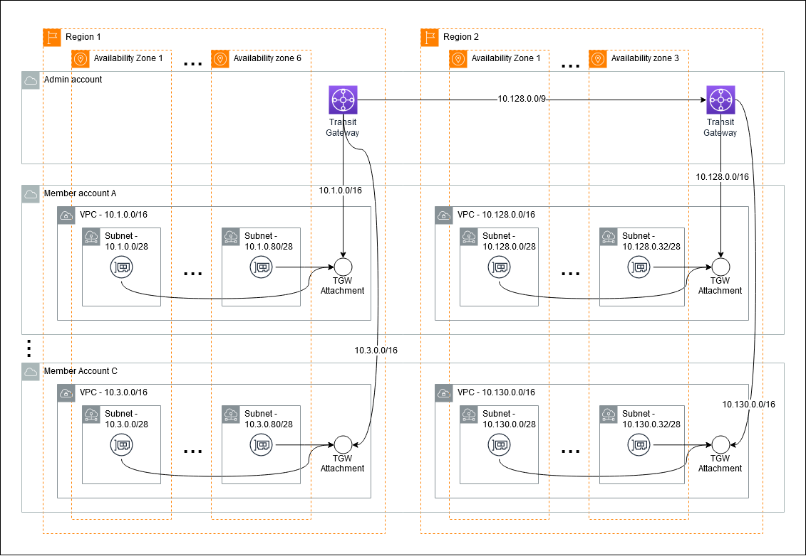
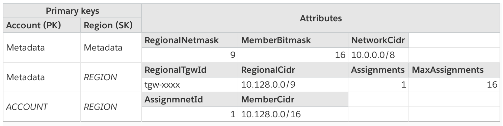

# Multi-account network

## Intro

Control Tower creates isolated VPCs, using the same CIDR range which is great for isolation but doesn’t allow for peering. Customers that requires cross-account networking need something else.

This solution provides a light-weight way of creating cross-account, cross-region VPCs.

## **Use cases and target customers**

1. **New customer setting up Control Tower:** as customers implement a multi-account strategy, they often need to have network connection between them. Setting up a cross-account, cross-region account can involve multiple services: VPC, TGW, RAM, Organizations. This solution helps get new customers started quickly
2. **Customers with highly independent teams and environments:** customers that use VPCs as a separation boundary ortogonal to accounts, need to to go through a multi-step process to get it working. This solution can be customized or leveraged as-is to improve agility
3. **Customers with testing or sandboxing needs:** easily setting up a cross-region cross-account VPC can be helpful for customers that need to run tests in these kinds of environments for consistency and/or security reasons. This solution can be used to minimize effort in setting up an isolated environment

All the above scenarios can help customers address use cases for rapidly deploying networks for 

* Multi-Account microservices API architecture
* Multi-region application networks

## Architecture

Customers would create a Stack Set using our template and specify:

1. `NetworkCidr: `The CIDR for the network
2. `Regions:` Regions the network cell will span
3. `TargetOUs:` List of OUs to deploy VPCs to
4. `MaxAccounts:` The max number of account _in each region_
5. `AdminAccount:` account that should host the main TGW

Additionally, the following variables will be referenced on the process (explained in the next section):

1. `AdminRegion:` the first region in the Regions list
2. `OtherRegions:` the second onwards regions in the Regions list, if any
3. `RegionalNetmask:` calculate netmask for regions, for routing purposes
4. `RegionalCidr:` especific CIDR range for a region using RegionalNetmask
5. `MemberBitmask:` calculate netmask for VPC in the member accounts, for configuring VPC CIDR purposes
6. `RegionalTgwId:` TGW id for a particular region
7. `AssignmentId:` a unique and sequential _within a region_, for configuring VPC CIDR purposes
8. `Assignments:` an atomic counter _within a region,_ used to vend unique AssignmentId
9. `MaxAssignments:` maximum number of Assignments _within a region,_ that can be vended. This is different (*equals or greater than*) MaxAccounts.

The process followed on the template will be:

1. In `AdminAccount`, as specified in `AdminAccount`:
    1. Create a TGW with auto-accept
    2. Share the TGW with `TargetOUs`
    3. In `AdminRegion`:
        1. Create a DynamoDB table
        2. Create IAM Role for DynamoDB access with trust policy from `AdminAccount` and `TargetOUs`
        3. Load DynamoDB:
            1. Calculate the largest Netmask within `NetworkCidr` such that it can accommodate *at least* the number of regions. Store `RegionalNetmask` in metadata and pre-populate table with `RegionalCidr` for each region.
                1. **Example:** for a NetworkCidr of 10.0.0.0/8 and 2 regions would result in `/9` - so regional CIDRs would be 10.0.0.0/9 and 10.128.0.0/9 (2 exactly)
            2. Calculate the largest Netmask within `RegionalNetmask` such that it can accommodate *at least* `MaxMaxAccounts` VPCs. Store `MemberBitmask` in metadata (should be the same for all regions). If `MemberBitmask`  is less than 16, make it 16 (AWS’ minimum)
                1. **Example:** for a RegionalCidr of /9 and a MaxAccounts of 10, we would need `/14` VPCs. Beause AWS’ minimum is /16, we’ll use it instead. So VpcCIDRs for a 10.128.0.0/9 RegionalCidr would be 10.128.0.0/16, 10.128.1.0/16, ... 10.128.2.0/14
            3. Calculate the `MaxAssignments` per region: using a `VpcNemasks`, how many CIDRs can we generate without bumping into another RegionalCidr.
                1. **Example:** in the previous example MaxAccounts specified was 10, but MaxAssignments would be 16 - there are 16 CIDRs /14 starting at 10.128.0.0/14 within 10.128.0.0/9 RegionalCidr
            4. Store `RegionalTgwId` and Region
        4. Create a Lambda function that triggers from DynamoDB Inserts:
            1. If it’s a `RegionalTgwId` being inserted:
                1. Generate a static TGW Route using `RegionalCidr`  to this `RegionalTgwId` 
    4. In every region other than `AdminRegion`:
        1. Generate expected ARN for DynamoDB from `AdminAccount` and `StackName`
        2. Assume IAM Role
        3. Look up `RegionalTgwId` in region `AdminRegion` and the `RegionalCidr`  for this region
        4. Create a TGW Peering Attachment using `AdminRegion` and retrived `RegionalTgwId` 
        5. Create static TGW Route for `CellCidr` to the TGW Peering Attachment created
        6. Store `RegionalTgwId` and Region into DynamoDB
2. In all member accounts part of `TargetOUs`
    1. Generate expected ARN for DynamoDB from `AdminAccount`, `AdminRegion` and `stack name`
        1. Look up relevant `RegionalTgwId`, `RegionalCidr`, `AccountNetmak` and an generate an `AssignmentId` from central DynamoDB table
        2. `AssignmentId` will be a unique, sequencial number, generated through DynamoDB’s Atomic Counter
        3. Using the base ip for `RegionalCidr` we will calculate the `"AssignmentId"`*th* CIDR range using `MemberBitmask`
            1. Example: for a RegionalCidr of 10.128.0.0/8, an MemberBitmask of /14 and an AssignmentId of 2, we’ll end with a VPC CIDR of 10.132.0.0/14
    2. Create a VPC using the CIDR calculated
    3. Within the VPC, a Lambda function will create a `/28` subnet for each AZ available in that region
    4. Create a TGW VPC Attachment to `RegionalTgwId`, using all subnets generated in previous step
    5. Alter VPC’s default route table to add route to TGW

## Diagrams

### Example of an end network topology




### DynamoDB data model



## Components

### Vending CIDRs

Upon creation of each member account, a Lambda will query that DynamoDB table:

* Atomically increment `Assignments `for  `HashKey=Metadata, RangeKey=`*`REGION`* by 1, return the final number as `Assignment`I`d`
* If `Assignment`s is greater than `MaxAssignments`, throw an error
* Read the `RegionalCidr` for `HashKey=Metadata, RangeKey=`*`REGION`* 
* Read the `MemberBitmask `for `HashKey=Metadata, RangeKey=Metadata`
* Calculate `MemberCidr `based on `AssignmentId` and `RegionalCidr`:
    * Starting from base ip for `RegionalCidr`, get the Nth (`AssignmentId`) CIDR with a `MemberBitmask` netmask
* Add { AssignmentId: `AssignmentId`, MemberCidr: `MemberCidr`} to `HashKey=`*`ACCOUNT`*`, RangeKey=`*`REGION`*

## Creating subnets for TGW Attachment on member account

The solution will create a subnet in each AZ for that particular region. Subnets will be creating using the first /28 ranges of the VPC CIDR block. Currently AWS has at most 6 AZs assigned to a particular account, so you consider the first /25 range of your VPC unusable. Example:

1. VPC: 10.1.0.0/16
2. Subnets created (assuming 6 AZs):
    1. 10.1.0.0/28
    2. 10.1.0.16/28
    3. 10.1.0.32/28
    4. 10.1.0.48/28
    5. 10.1.0.64/28
    6. 10.1.0.80/28
3. In this case you should not use 10.1.0.0/25. Example of subnets you can create yourself:
    1. 10.1.0.128/25
    2. 10.1.2.0/24
    3. 10.1.3.0/24
    4. ...

## FAQ

1. Can I update CloudFormation parameters (e.g. add regions, change CIDR)?

No. There's no support for updates, as this would change the way addresses get allocated and routes are defined. If you need to extend your network, you can still use secondary CIDRs and manually extend your network.

2. What happens if an account is moved out of the OU?

Nothing will change, and network won't be touched. The network uses stack sets configured to retain stack instances if accounts get moved out of the OU. If you whish to deprovision the network, you can remove stack instances explicitly through the CloudFormation console, which should deprovision the resources in an ordely fashion. Make sure you do this _before_ the account is moved out of the OU. The deletion process requires cross-account access to the Admin account, which is only granted to the target OU. If you move it first, it won't have privileges required to deprovision the account.

Please note that there's no special provision to clean up your VPC. You still need to do that, else the stack deletion may fail.

3. What if I want to have more than one Baseline template? Or specific Baseline templates for different conditions?

There's nothing special about the BaselineTemplate parameter. You can take a look at the CloudFormation template and see it creates a StackSet targeting the OU using the BaselnieTemplate parameter (see `net-local-admin.yaml` for an example). You can create additional StackSets following that pattern.

Most regular CloudFormation templates can be adapted to be used as a baseline. The main thing to be aware is networking: you may need to leverage this solution's custom resources and wait mechanism to make sure account's VPC is fully provisioned and CIDRs don't overlap (see `ec2-ssm.yaml` for an example).

4. What happens if I create more than 16 accounts in a region?

New accounts will likely fail to provision and won't be automatically added as part of the network. The default `MaxAccounts` is set to 16 and not made a parameter for simplicity, but can easily be changed editing `net-local-admin.yaml`.

5. Can I disable automatic provisioning of new accounts?

Yes. You can change any of the defaults by editing `net-local-admin.yaml`. More specifically, edit the `AutoDeployment` property.

## Troubleshooting

This solution creates additional Stacks, Stack Sets and Stack Instances. If you face errors with how your network is deployed, you'll need to navigate through the created resources to trobleshoot it.

**1. Common issues**

1. Check your SCPs
2. Check your service limits (e.g. number of VPCs and TGWs)
3. Make sure your network can accomodate all the regions and accounts. See [Automate Networking foundation in multi-account environments](https://aws.amazon.com/blogs/networking-and-content-delivery/automate-networking-foundation-in-multi-account-environments/) for details on how network is setup.

A single-region network should be at least a '/21'. This allows all the resources needed to configure the network to be created but that will leave minimum to no space to setup anything else, so you likely want a '/20' or larger network. NOTE: If you are using the example BaselineTemplate, you'll need a '/19' network or larger (see the **Default baseline template: invalid CIDR** section below for details).

_Explanation_: Assuming a maximum 8 AZs per region, a '/28' subnet per AZ, the VPC will have to be at least a '/25' to accomodate the 8 subnets. Assuming a MaxAccount value of 16 (the default), a single-region multi-account network will have to be at least a '/21' to accomodate the 16 VPCs.

If you are setting up 1 Secondary Region, it would have to be at least a '/20'. If you have 2 or 3 Secondary Regions it would have to be at least a '/19' and so on.

**2. Organizational Unit could not be found**

```
OrganizationalUnit ou-xxxx-xxxxxxxx in unknown organization could not be found. (Service: AWSRAM; Status Code: 400; Error Code: UnknownResourceException; Request ID: xxxxxxxx-xxxx-xxxx-xxxx-xxxxxxxxxxxx; Proxy: null)
```

Make sure you enabled RAM integration with Organizations. If you haven't done it through RAM console, check documentation for additional steps. 

**3. Failed creating StackSets issues**

```
Resource handler returned message: "Account used is not a delegated administrator (Service: CloudFormation, Status Code: 400, Request ID: xxxxxxxx-xxxx-xxxx-xxxx-xxxxxxxxxxxx, Extended Request ID: null)" (RequestToken: xxxxxxxx-xxxx-xxxx-xxxx-xxxxxxxxxxxx, HandlerErrorCode: InvalidRequest)
```

or 

```
Resource handler returned message: "Stack set operation [xxxxxxxx-xxxx-xxxx-xxxx-xxxxxxxxxxxx] was unexpectedly stopped or failed" (RequestToken: xxxxxxxx-xxxx-xxxx-xxxx-xxxxxxxxxxxx, HandlerErrorCode: InternalFailure)
```

Make sure you that Cloudformation integration with Organizations is enabled and your account is registered as a delegated administrator

**4. Failed to create MemberStackSet**

```
Properties validation failed for resource MemberStackSet with message: #: #: only 1 subschema matches out of 2 #/StackInstancesGroup/0/Regions: array items are not unique
```

Make sure you are not selecting the region you are in as a SecondaryRegion. If you want your network to be single region, leave SecondaryRegion empty.

**5. Default baseline template: WaitCondition error**

```
ResourceLogicalId:WaitCondition, ResourceType:AWS::CloudFormation::WaitCondition, ResourceStatusReason:Failed to receive 1 resource signal(s) within the specified duration.
```

That means the VPC for that account wasn't successfully created. Check MemberStackSet for additional information

**6. Default baseline template: cannot connect to EC2 using Session Manager**

If you are getting an error saying Session Manager is not configured and you can't connect to the instance, make sure you allowed enough time for the instance to fully boot up. It may take a few minutes

**7. Default baseline template: instance type is not supported**

```
Your requested instance type (t2.micro) is not supported in your requested Availability Zone (xx-xxxxx-xx). Please retry your request by not specifying an Availability Zone or choosing ... 
```

This means the instance used in the baseline example (t2.micro) is not available in the region and/or AZ. Either change the template to use a different instance type or select different regions.

**8. Default baseline template: invalid CIDR**

```
ResourceLogicalId:rPrivateSubnet, ResourceType:AWS::EC2::Subnet, ResourceStatusReason:The CIDR 'x.x.x.x/24' is invalid.
```

This means your multi-account network is too small to accomodate your resources. The example template creates a '/24' subnet in the VPC, so you'd need at least a '/23' VPC. That will allow all the resources needed for setting up the network plus the '/24' subnet this example template creates (see **Common issues** section above for more details).

In order to have a '/23' VPC, you'd need a '/19' single-region network to acommodate the default MaxAccount of 16 VPCs.

## Limitations

* Only works for ipv4
* Cannot recycle used CIDRs (i.e. ranges from deleted accounts are not reclaimed)
* Cannot add/remove regions, only accounts
* Different **AmazonAsn** is not configurable
* Workarounds:
    * Cloudformation doesn’t support TGW Peering Attachments, this is done through Lambda
    * Cloudformation doesn’t support creation of subnets per AZ, this is done through Lamdbna


